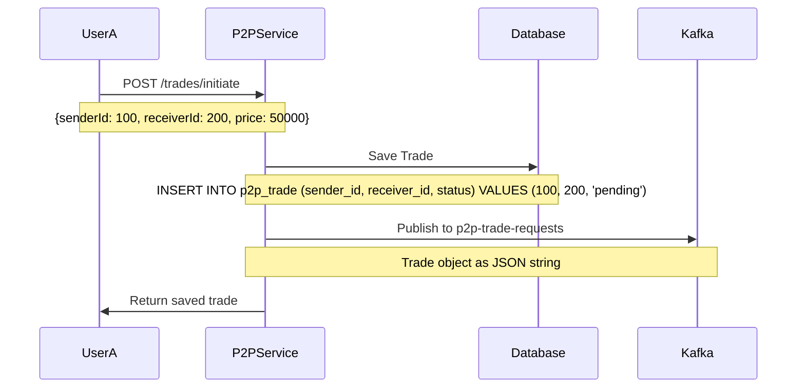
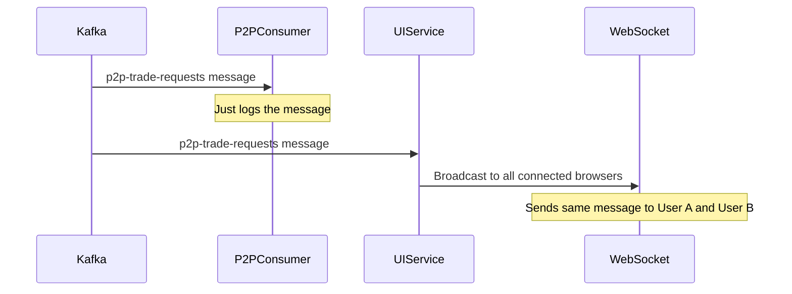
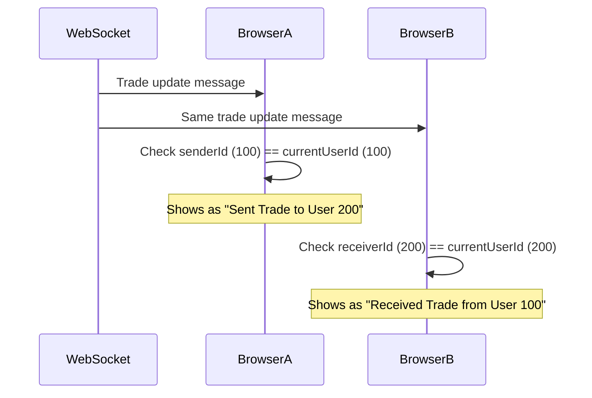

# P2P Trading Architecture - Complete Reference Guide

## Table of Contents
1. [Overview](#overview)
2. [System Architecture](#system-architecture)
3. [Complete Flow Walkthrough](#complete-flow-walkthrough)
4. [Key Components](#key-components)
5. [Common Misconceptions](#common-misconceptions)
6. [Code Examples](#code-examples)
7. [Troubleshooting](#troubleshooting)
8. [Architecture Decisions](#architecture-decisions)

---

## Overview

This document explains the complete P2P (Peer-to-Peer) trading architecture in the MarketPulse platform. The system allows users to trade directly with each other in real-time using a microservices architecture with Kafka for event-driven communication.

### Key Concepts
- **Single Service Instance**: One P2P trading service handles all users
- **Event-Driven Architecture**: Kafka topics for real-time communication
- **Role-Based Display**: Same trade appears differently for sender vs receiver
- **Real-Time Updates**: WebSocket for immediate UI updates

---

## System Architecture

### High-Level Architecture
```
┌─────────────────┐    ┌─────────────────┐    ┌─────────────────┐
│   User A        │    │   User B        │    │   User C        │
│   (Browser)     │    │   (Browser)     │    │   (Browser)     │
└─────────┬───────┘    └─────────┬───────┘    └─────────┬───────┘
          │                      │                      │
          └──────────────────────┼──────────────────────┘
                                 │
                    ┌─────────────┴─────────────┐
                    │      UI Service           │
                    │   (WebSocket + Kafka)     │
                    └─────────────┬─────────────┘
                                  │
                    ┌─────────────┴─────────────┐
                    │         Kafka             │
                    │   (Event Broker)          │
                    └─────────────┬─────────────┘
                                  │
                    ┌─────────────┴─────────────┐
                    │   P2P Trading Service     │
                    │   (Business Logic)        │
                    └─────────────┬─────────────┘
                                  │
                    ┌─────────────┴─────────────┐
                    │      Database             │
                    │   (PostgreSQL/H2)         │
                    └───────────────────────────┘
```

### Service Responsibilities

| Service | Responsibility | Kafka Role |
|---------|---------------|------------|
| **P2P Trading Service** | Business logic, database operations | Producer + Consumer (logging) |
| **UI Service** | Real-time UI updates, WebSocket management | Consumer |
| **Kafka** | Event broker, message persistence | Message broker |

---

## Complete Flow Walkthrough

### Scenario: User A sends a trade request to User B

#### Step 1: Trade Initiation


#### Step 2: Event Processing


#### Step 3: Frontend Processing


---

## Key Components

### 1. P2P Trading Service

#### Producer (Publishes Events)
```java
@Service
public class P2PTradeKafkaProducer {
    @Autowired
    private KafkaTemplate<String, String> kafkaTemplate;

    public void sendTradeRequest(P2PTrade trade) {
        sendMessage("p2p-trade-requests", trade);
    }

    public void sendTradeNegotiation(P2PTrade trade) {
        sendMessage("p2p-trade-negotiations", trade);
    }

    public void sendTradeConfirmation(P2PTrade trade) {
        sendMessage("p2p-trade-confirmations", trade);
    }
}
```

#### Consumer (Just Logging)
```java
@Service
public class P2PTradeKafkaConsumer {
    @KafkaListener(topics = "p2p-trade-requests", groupId = "p2p-trading-group")
    public void listenTradeRequests(String message) {
        System.out.println("[Kafka] Received trade request: " + message);
        // NO BUSINESS LOGIC - Just logging
    }
}
```

#### Service Layer (Business Logic)
```java
@Service
public class P2PTradeService {
    public P2PTrade initiateTrade(P2PTrade trade) {
        // 1. Save to database
        P2PTrade saved = tradeRepository.save(trade);
        
        // 2. Publish to Kafka
        kafkaProducer.sendTradeRequest(saved);
        
        return saved;
    }
}
```

### 2. UI Service

#### Consumer (Handles Real-Time Updates)
```java
@Component
public class P2PTradeConsumer {
    @Autowired
    private P2PWebSocketHandler p2pWebSocketHandler;

    @KafkaListener(topics = "p2p-trade-requests", groupId = "ui-desk-p2p-consumer-group")
    public void consumeP2PTradeRequest(String message) {
        // Broadcast to ALL connected browsers
        p2pWebSocketHandler.broadcastP2PUpdate(message);
    }
}
```

#### WebSocket Handler
```java
@Component
public class P2PWebSocketHandler extends TextWebSocketHandler {
    private final Set<WebSocketSession> sessions = new HashSet<>();

    public void broadcastP2PUpdate(Object p2pData) {
        String message = objectMapper.writeValueAsString(p2pData);
        TextMessage textMessage = new TextMessage(message);
        
        // Send to ALL connected browsers
        sessions.removeIf(session -> {
            try {
                if (session.isOpen()) {
                    session.sendMessage(textMessage);
                    return false; // Keep session
                }
            } catch (Exception e) {
                // Handle error
            }
            return true; // Remove broken session
        });
    }
}
```

### 3. Frontend JavaScript

#### WebSocket Connection
```javascript
connectP2PWebSocket() {
    const wsUrl = `${protocol}//${window.location.host}/ws/p2p`;
    this.p2pSocket = new WebSocket(wsUrl);
    
    this.p2pSocket.onmessage = (event) => {
        this.handleP2PMessage(event.data);
    };
}
```

#### Message Processing
```javascript
handleP2PMessage(data) {
    const message = JSON.parse(data);
    
    if (message.id && message.senderId && message.receiverId) {
        const trade = message;
        
        // Refresh trade list
        this.loadP2PTrades();
        
        // Show appropriate message based on user role
        if (trade.senderId === this.currentUserId) {
            this.addNegotiationMessage('System', `Trade #${trade.id} sent to User ${trade.receiverId}`);
        } else if (trade.receiverId === this.currentUserId) {
            this.addNegotiationMessage('System', `Trade #${trade.id} received from User ${trade.senderId}`);
        }
    }
}
```

---

## Common Misconceptions

### ❌ Misconception 1: Multiple P2P Service Instances
**Wrong**: "Each user has their own P2P trading service instance"
**Correct**: "One P2P trading service instance handles all users"

### ❌ Misconception 2: Duplicate Database Saves
**Wrong**: "User A and User B both save the trade to database"
**Correct**: "Only User A saves the trade, User B just queries existing trades"

### ❌ Misconception 3: P2P Consumer Does Business Logic
**Wrong**: "P2P consumer processes trade events for business logic"
**Correct**: "P2P consumer only logs events, no business logic"

### ❌ Misconception 4: Separate Messages for Each User
**Wrong**: "UI service sends different messages to different users"
**Correct**: "UI service broadcasts the same message to all users, frontend filters"

---

## Code Examples

### Database Query (Key to User Separation)
```java
// Repository method that enables user-specific views
public interface P2PTradeRepository extends JpaRepository<P2PTrade, Long> {
    List<P2PTrade> findBySenderIdOrReceiverId(Long senderId, Long receiverId);
}

// Service method
public List<P2PTrade> getUserTrades(Long userId) {
    // Returns trades where user is either sender OR receiver
    return tradeRepository.findBySenderIdOrReceiverId(userId, userId);
}
```

### Frontend Trade Loading
```javascript
async loadP2PTrades() {
    // Always fetch trades for current user (sender OR receiver)
    const response = await fetch(`http://localhost:8083/trades/${this.currentUserId}`);
    this.p2pTrades = await response.json();
    this.renderP2PTrades();
}
```

### Trade Display Logic
```javascript
renderP2PTrades() {
    this.p2pTrades.forEach(trade => {
        const isSender = trade.senderId === this.currentUserId;
        const isReceiver = trade.receiverId === this.currentUserId;
        
        if (isSender) {
            // Show as "Sent Trade"
            li.innerHTML = `<strong>Trade #${trade.id}</strong> - Sent to User ${trade.receiverId}`;
        } else if (isReceiver) {
            // Show as "Received Trade"
            li.innerHTML = `<strong>Trade #${trade.id}</strong> - Received from User ${trade.senderId}`;
        }
    });
}
```

---

## Troubleshooting

### Issue 1: User Not Seeing Trades
**Symptoms**: User doesn't see trades they should see
**Check**:
1. Verify `currentUserId` is correct in frontend
2. Check database query: `findBySenderIdOrReceiverId(userId, userId)`
3. Verify WebSocket connection is established

### Issue 2: Duplicate Trades
**Symptoms**: Same trade appears multiple times
**Check**:
1. Ensure P2P consumer doesn't save to database
2. Verify `loadP2PTrades()` is called only when needed
3. Check for multiple WebSocket connections

### Issue 3: Real-Time Updates Not Working
**Symptoms**: UI doesn't update when trades change
**Check**:
1. Kafka consumer is running in UI service
2. WebSocket connection is active
3. Frontend `handleP2PMessage()` is working

### Issue 4: Performance Issues
**Symptoms**: Slow UI updates or high resource usage
**Check**:
1. Reduce frequency of `loadP2PTrades()` calls
2. Optimize WebSocket message size
3. Consider user-specific WebSocket channels

---

## Architecture Decisions

### Why Single Service Instance?
- **Resource Efficiency**: One service handles all users
- **Data Consistency**: Single source of truth for business logic
- **Simplified Deployment**: Easier to manage and scale

### Why Broadcast to All Users?
- **Simplicity**: No complex message routing
- **Real-Time**: All users get immediate updates
- **Frontend Filtering**: Each browser shows relevant data

### Why P2P Consumer Exists?
- **Logging**: Track all trade events
- **Debugging**: Monitor system activity
- **Future Expansion**: Ready for business logic if needed

### Why OR Query in Database?
- **Single Record**: One trade record for both users
- **Efficient Queries**: One query gets all user's trades
- **Data Integrity**: No duplicate records or sync issues

---

## Quick Reference

### Flow Summary
1. **User A** → P2P Service → Save to DB → Publish to Kafka
2. **Kafka** → UI Service → Broadcast via WebSocket
3. **All Browsers** → Receive same message → Filter by user role
4. **User A** sees "Sent Trade", **User B** sees "Received Trade"

### Key Files
- `P2PTradeService.java` - Business logic
- `P2PTradeKafkaProducer.java` - Event publishing
- `P2PTradeConsumer.java` - Event logging (UI service)
- `P2PWebSocketHandler.java` - Real-time updates
- `index.html` - Frontend logic

### Kafka Topics
- `p2p-trade-requests` - New trade initiations
- `p2p-trade-negotiations` - Negotiation messages
- `p2p-trade-confirmations` - Accept/reject actions

### Consumer Groups
- `p2p-trading-group` - P2P service consumer
- `ui-desk-p2p-consumer-group` - UI service consumer

---

## User's Understanding (In Their Own Words)

> "Ahh got it. A sends, there's just one instance running so it'll save to db and will publish trade on kafka topic. In p2p-trading we have consumer for the same topic which will only log it but ui-service will listen to the topic and here both User A & B users will pick up the trade but using the sender and receiver id they'll separate this trade, and will decide whether to show this as send trade blah blah blah or should print received trade blah blah blah."

**This understanding is 100% correct!** This captures the essence of the architecture perfectly.

---

## Conclusion

This architecture provides a clean, efficient, and scalable solution for P2P trading with real-time updates. The key insight is that **one service instance handles all users**, **one database record serves both sender and receiver**, and **frontend filtering provides personalized views**.

For questions or clarifications, refer to this document before starting new conversations! 